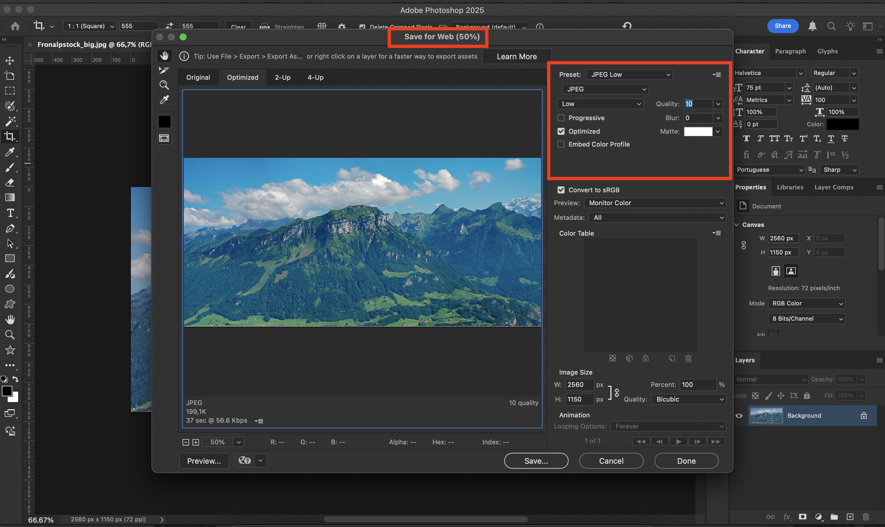

# responsive_images

## Fuzzy Responsive Images

This repository contains tests comparing images exported directly from CoreMedia Studio with images exported from Photoshop, using different compression levels and dimensions.

### Objective

Evaluate the impact of compression and resizing on visual quality and file size, in order to find the best balance between quality and performance for different image formats (e.g., 1:1, 4:3, 8:3).

### Methodology

- **Studio Export:** Images generated directly by CoreMedia Studio.
- **Photoshop Export:** Images exported from Photoshop with different compression levels (e.g., 60%, 30%, 10%, 5%) and dimensions (original and cropped).
- **Visual Comparison:** Images can be reordered by drag-and-drop on the test pages to facilitate personalized comparison.
- **File Size Analysis:** Each image displays its file size in KB for efficiency analysis.

### How to Compare

1. Open the HTML files for each ratio (e.g., `comparison_1:1.html`, `comparison_4:3.html`).
2. Drag the images up or down to facilitate visual comparison.
3. Analyze the visual quality and file size for each method.

### Screenshots of Photoshop Compression and Crop Methods

In the `screenshots/` folder you will find screenshots showing the parameters used in Photoshop for image compression and cropping.

- 

---

If you need code examples or more details about the tests, check the HTML files included in this directory.
