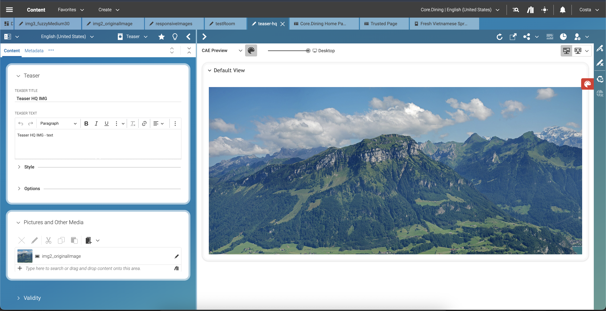
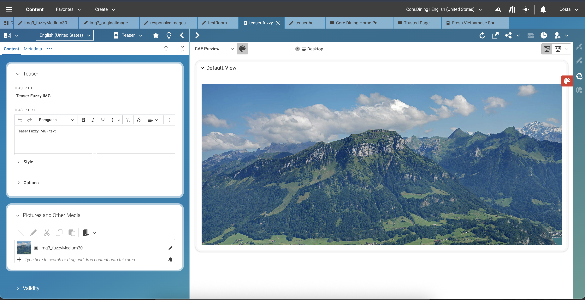
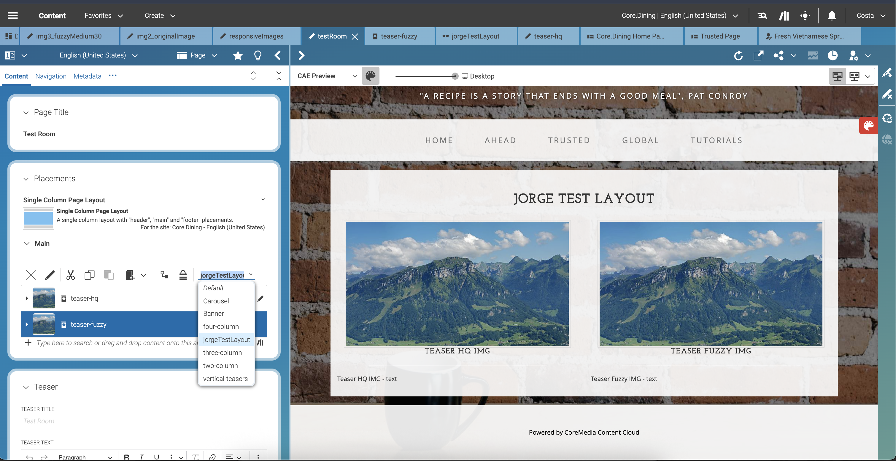
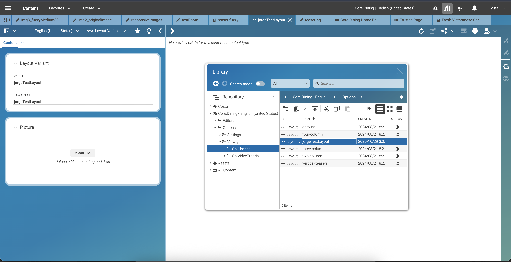
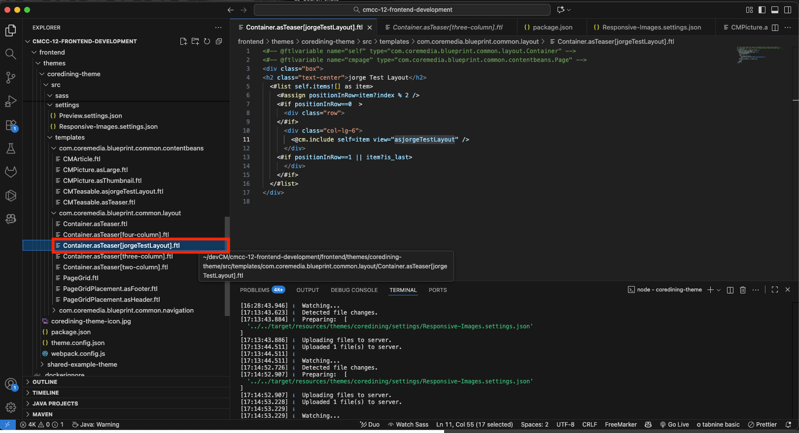
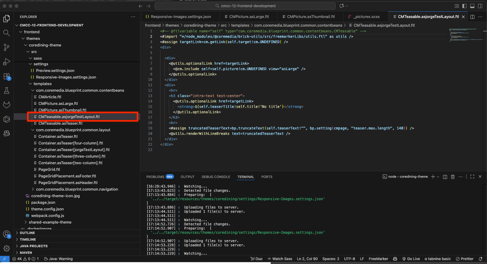

## Fuzzy Responsive Images

This repository contains tests comparing images exported directly from **CoreMedia Studio** using different compression levels and dimensions.  
It also includes a local setup **CoreMedia CAE preview**.

---

### Objective

Evaluate the **impact of compression, resizing, and scaling** on both **visual quality** and **file size**, in order to determine the optimal balance between quality and performance across multiple formats and resolutions (e.g., 1:1, 4:3, 8:3).

---

#### 🧩 HTML-Based Comparison

The main test page (`index.html`) includes 4 Ratios with:
- **2 HQ images** — one at normal resolution and one delivered at **2× size**.  
- **2 Fuzzy images** — one at normal resolution and one delivered at **2× size**.  
- These combinations are used to evaluate **downscaling effects**.

---

**CoreMedia Studio**:
- Repository with frontend files
- https://github.com/jcostacoremedia/responsive_images/edit/main/README.md

Two teasers were created — each configured with a specific test image (HQ or Fuzzy).
- 
- 

These teasers were added to a **custom test page** for live comparison.
- 

A **layout variant** was created to provide a tailored visual structure inside the CAE preview environment.
- 

The layout is **accessible through the local CoreMedia test environment**, allowing responsive and rendering tests directly in preview.
- 
- 

**Author:** Jorge Costa  
Frontend Developer — CoreMedia Test Environment
