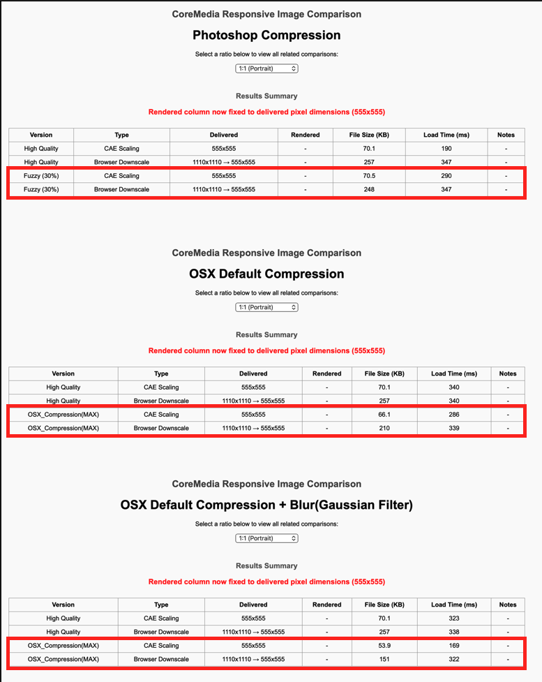

## Fuzzy Responsive Images

This repository contains tests comparing images exported directly from **CoreMedia Studio** using different compression levels and dimensions.  
It also includes a local setup **CoreMedia CAE preview**.

---

### Objective

Evaluate the **impact of compression, resizing, and scaling** on both **visual quality** and **file size**, in order to determine the optimal balance between quality and performance across multiple formats and resolutions (e.g., 1:1, 4:3, 8:3).

---

#### 🧩 HTML-Based Comparison

The main test page (`index_photoshop_compression.html`) includes 4 Ratios with:

- **2 HQ images** — one at normal resolution and one delivered at **2× size**.
- **2 Fuzzy images** — one at normal resolution and one delivered at **2× size**.
- These combinations are used to evaluate **downscaling effects**.

---

#### 🧩 Creation 2 More Index files

- (`index_OSX_compression.html`) - uses images compressed with the default macOS compression.
- (`index_Blur_OSX_compression.html`) - uses the same images, also compressed with macOS, but with an additional Gaussian Blur filter applied in Photoshop.

Two teasers were created — each configured with a specific test image (HQ or Fuzzy).

- 

**Author:** Jorge Costa  
Frontend Developer — CoreMedia Test Environment
